# aws-ecr-ecs-project


### Live Deployement Link:

- [http://test-lb-tf-1950362408.eu-central-1.elb.amazonaws.com/](http://test-lb-tf-1950362408.eu-central-1.elb.amazonaws.com/)
## Steps

- [1. Create an Amazon ECR repository](#step-1)
- [2. Authenticate Docker with ECR and push the image](#step-2)
- [3. Create VPC networking](#step-3)
- [4. Create ECS cluster](#step-4)
- [5. Create ECS task definition](#step-5)
- [6. Create security groups](#step-6)
- [7. Create ELB and target group](#step-7)
- [8. Create ECS service and attach it to the load balancer](#step-8)
- [9. Test screenshots](#step-9)

---

### <a id="step-1"></a>2. Create an Amazon ECR Repository
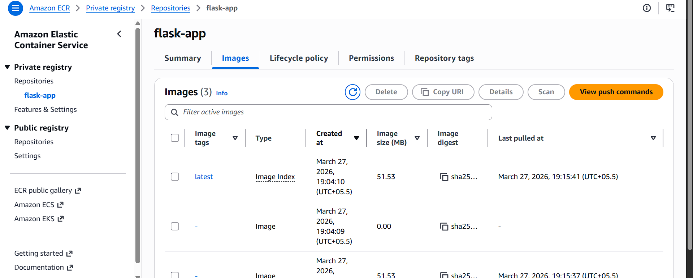

### <a id="step-2"></a>3. Authenticate Docker with ECR and Push the Image

- Steps to Build and Push Image:

  ```bash
  aws ecr get-login-password --region eu-central-1 | docker login --username AWS --password-stdin <UserID>.dkr.ecr.eu-central-1.amazonaws.com
  docker tag flask-app:latest <UserID>.ecr.eu-central-1.amazonaws.com/flask-app:latest
  docker push <UserID>.dkr.ecr.eu-central-1.amazonaws.com/flask-app:latest
  ```

### <a id="step-3"></a>4. Create VPC Networking

- Create VPC (Virtual Private Cloud)
  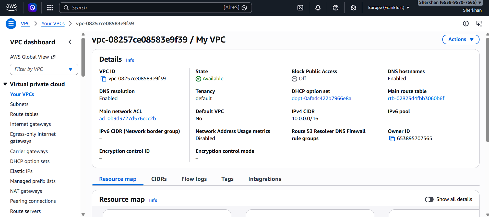

### <a id="step-4"></a>5. Create ECS Cluster

- ECS Cluster
  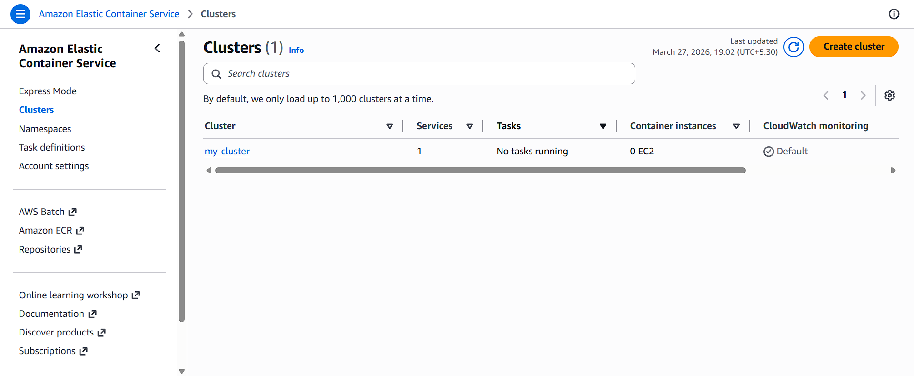

### <a id="step-5"></a>6. Create ECS Task Definition

- ECS task defination
  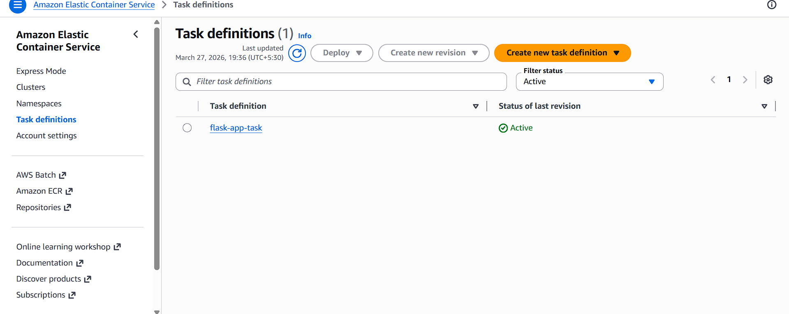

### <a id="step-6"></a>7. Create Security Groups

- Load Balancer SG
  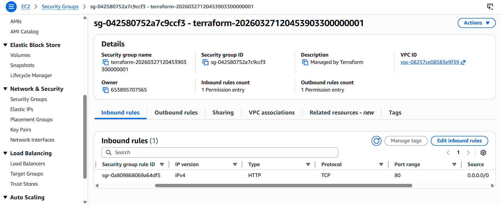

- ECS Service SG
  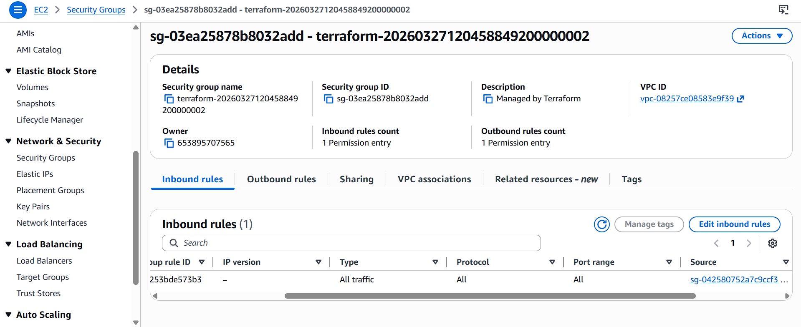

### <a id="step-7"></a>8. Create ELB and Target Group

- Load Balancer
  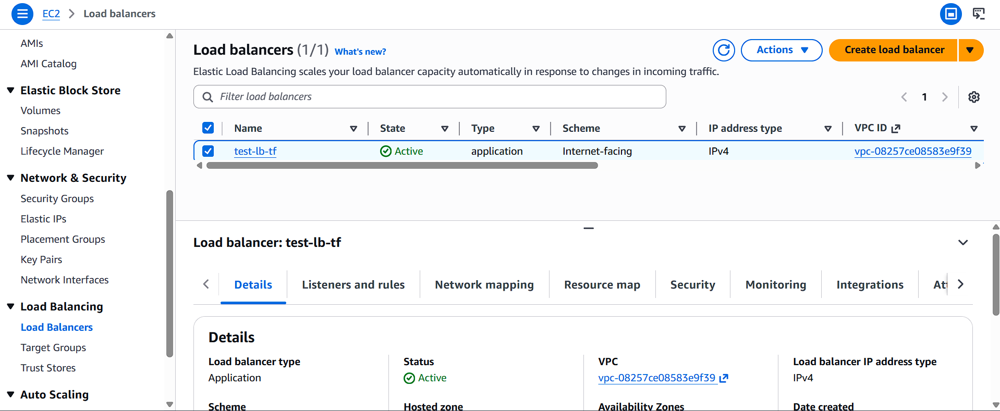
- Target Group
  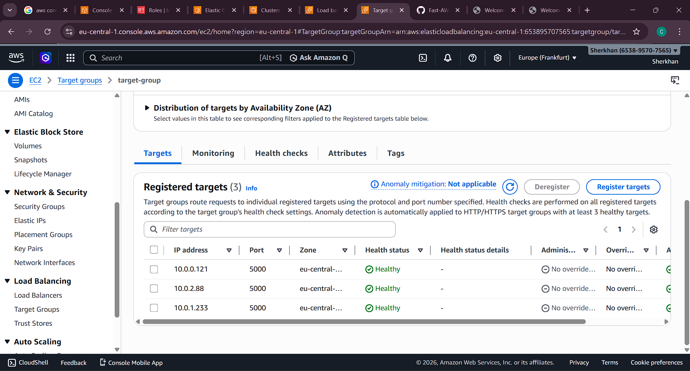

### <a id="step-8"></a>9. Create ECS Service and Attach It to the Load Balancer

- ECS Service
  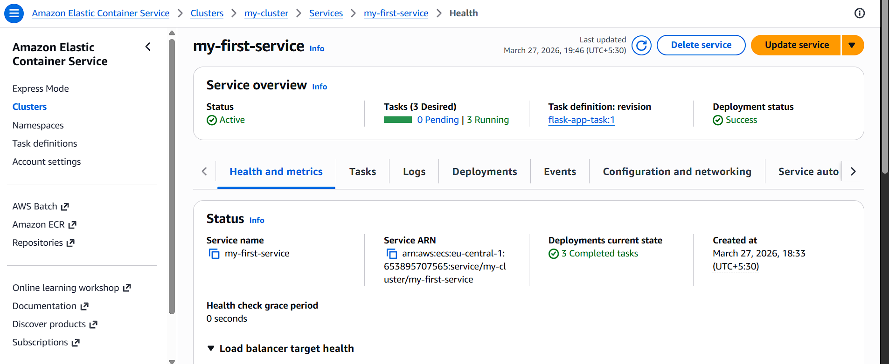
- ECS Service Tasks
  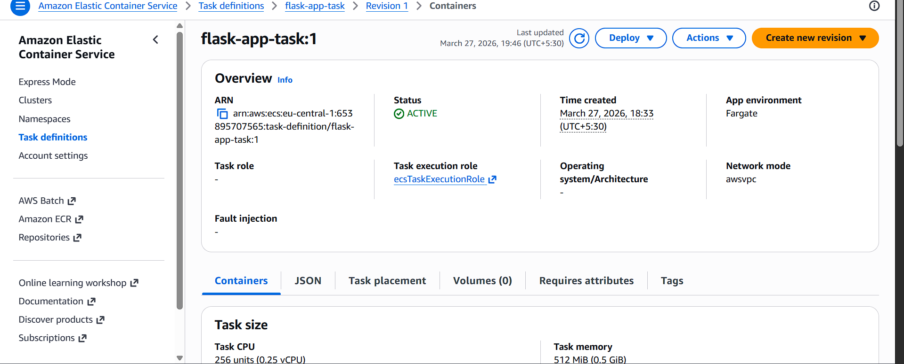

### <a id="step-9"></a>10. Verify Deployment with Test Screenshots

- Test 1
  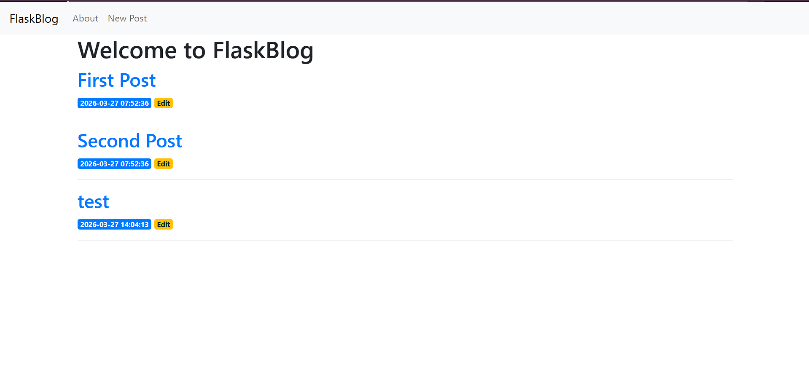
- Test 2
  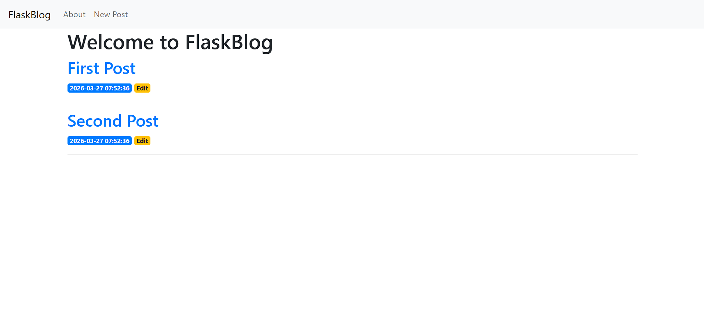
